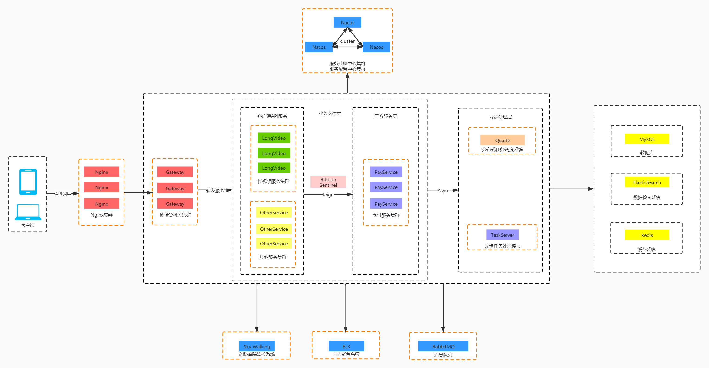
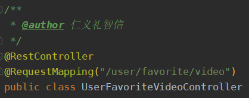
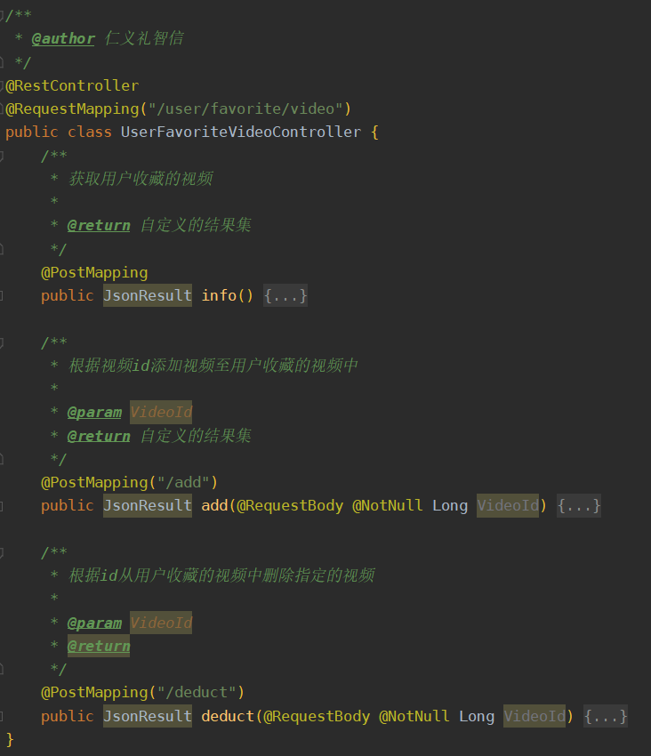
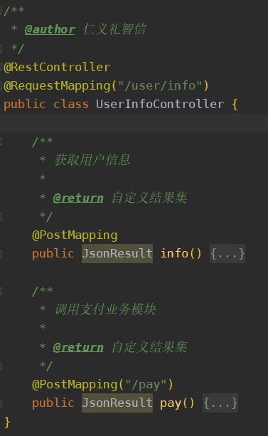

# Server Project
-------

##项目部署架构图

##开发业务架构
网关 - Gateway

    - 请求认证 √
    - 请求路径加解密 √
    - 请求体，响应体加解密 √
    - 防重(业务防重需要API接口方实现)
    - 防重放攻击
    - 链路追踪及服务监控
    
服务治理平台 - Nacos

    - 服务注册与发现 √
    - 服务配置中心 √
    
认证服务器 - Auth-Server

    - Token认证 √
    - 所有App登录与注册 √
    
长视频服务器 - Long-Video-Server

    - 用户相关业务
        - 每日任务
        - 用户信息
    - 视频业务
        - 排行榜
        - 模块配置
    - 支付业务
    
支付服务

    - 暂定
    
分布式搜索引擎

    - 暂定ES
    
任务调度

    - Quartz
    - ScheduledExecutor
    
任务异步处理服务

日志聚合系统

    - ELK
    
链路追踪监控系统

    - Sky Walking
    
##项目开发分层结构
1.Common 用于存放通用的类，如工具类，常量类等等

2.Controller 请求处理层，轻业务逻辑，参数校验，异常兜底，通常这种接口可以轻易更换接口类型，所以业务逻辑必须要轻，甚至不做具体逻辑。

3.Service 业务处理层，处理相对具体的业务逻辑，复用性较低，这里推荐每一个Controller方法都对应一个Service，不要把业务编排放在Controller中去做，否则以后接入比如Thrift这样的比其他RPC框架多一层作用类似于Controller层的RPC框架，又需要把业务编排再做一次，这会导致你每接入一个入口层，代码都得重新复制一份。

5.Manager 可复用逻辑层，主要作用如下
- 对多个Mapper层组合形成可以复用的聚合接口
- 抽取Service层可复用的逻辑作为通用逻辑

6.Mapper 数据访问层，操作关系型数据库

7.Pojo 领域模型层 
- Dto 数据传输对象，用于Service或Manager层向外传输的对象
- Entity 数据库实体对象，与数据库表结构对应
- Vo 请求数据对象，用于请求处理层封装请求参数

8.Rmi 三方接口调用层

##开发规范

**重要：由于客户端框架原因，返回结果如果不是花括号包裹的Map集合，data必须是一个Map键值对，如: **
    
    {
        "code": 0,
        "msg": "成功",
        "data": {
            "name": "张三",
            "age": 18,
            "gender": "男"
        }
    }
    
    
    {
        "code": 0,
        "msg": "成功",
        "data": {
            "historyList": [
                {
                    "watchDate": "2020-11-5",
                    "watchProgress": 99,
                    "videoId": 4,
                    "videoName": "第一滴血"
                },
                {
                    "watchDate": "2020-11-5",
                    "watchProgress": 99,
                    "videoId": 5,
                    "videoName": "第二滴血"
                },
                {
                    "watchDate": "2020-11-15",
                    "watchProgress": 2199,
                    "videoId": 6,
                    "videoName": "第三滴血"
                }
            ]
        }
    }
    
1. 定义一个类同时声明作者

     
     
2. 请求处理层定义规则

    - 定义一个请求处理层，类名必须见名知意(与当前业务逻辑挂钩)，**禁止用模糊的命名方式定义一个请求处理层**
        
    - 请求处理层映射路径必须和类名匹配，这样可以通过映射路径快速找到对应的类，以及映射路径见名知意，禁止在url中使用驼峰命名，出现驼峰命名必须使用‘/’分开
        - 正例
        
            UserInfoController 映射路径: /user/info
            
            UserTaskController 映射路径: /user/task
            
            UserFavoriteVideoController 映射路径: /user/favorite/video
            
        - 反例
            UserInfoController 映射路径: /userInfo
            UserTaskController 映射路径: /userTask
            
    - 确保一个请求处理层中只做一类事
        - 正例
        
            
            
        - 反例
        
            

3. 业务处理层
    - 目前规则同请求处理层

4. 数据持久层
    - 仅仅是单表查询可以直接使用【表名】+Mapper的持久层，当开发人员有这个概念后，可以避免简单的增删改查被创建多个Mapper的情况
